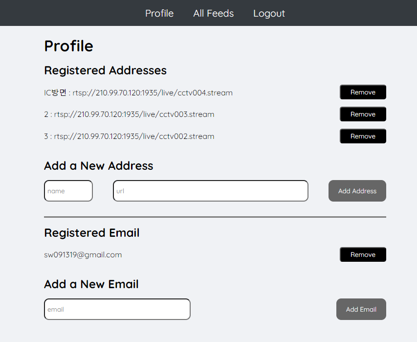
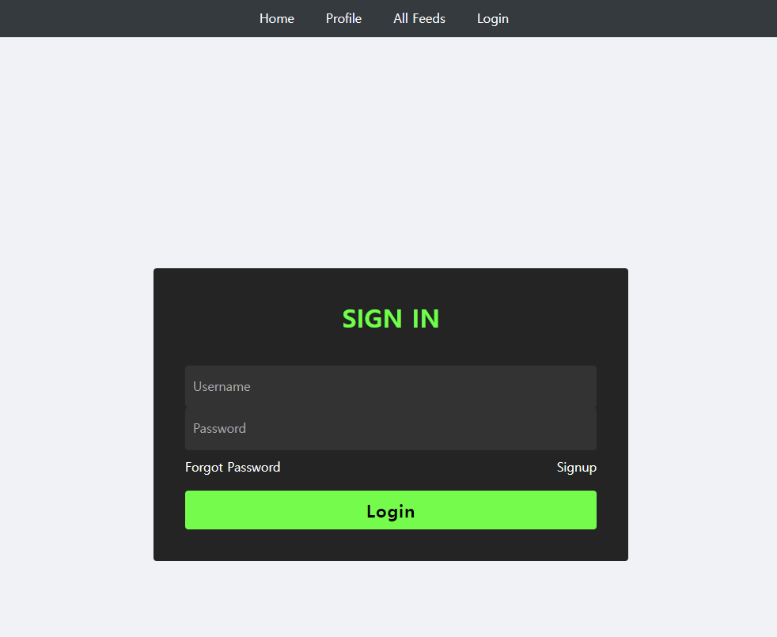

# CCTV 화재 감지 시스템 개발 및 연구

> CCTV 모니터링 서비스

## 모니터링 화면


## CCTV 추가 제거 화면



## 로그인 화면



## 사용법

0. git과 node 설치

1. 레파지토리 다운로드 및 라이브러리 설치

    ```shell
    git clone https://github.com/LChaeHyun/Project-hunetgaia.git
    cd Project-humetgaia/server
    npm install (미정)
    ```

2. 환경변수 설정

3. 데이터베이스 설정
    - 로컬에 hunet이라는 mysql db 추가 필요
    - db 구조
    ```shell
    create database hunet;
    use hunet;
    create table manager(
        id varchar(50) NOT NULL primary key,
        pwd varchar(50) not null
    );

    create table rtsp(
        id int primary key auto_increment,
        name varchar(50),
        ip_address varchar(200)
    );


    create table email(
        id int primary key auto_increment,
        address varchar(50) not null
    );
    ```

4. 실행(수정될수도)

    ```shell
    python detector.py
    python monitor.py
    npm start
    ```

5. 모니터링 확인

    - localhost:3000으로 접속 시 모니터링 페이지 확인 가능

